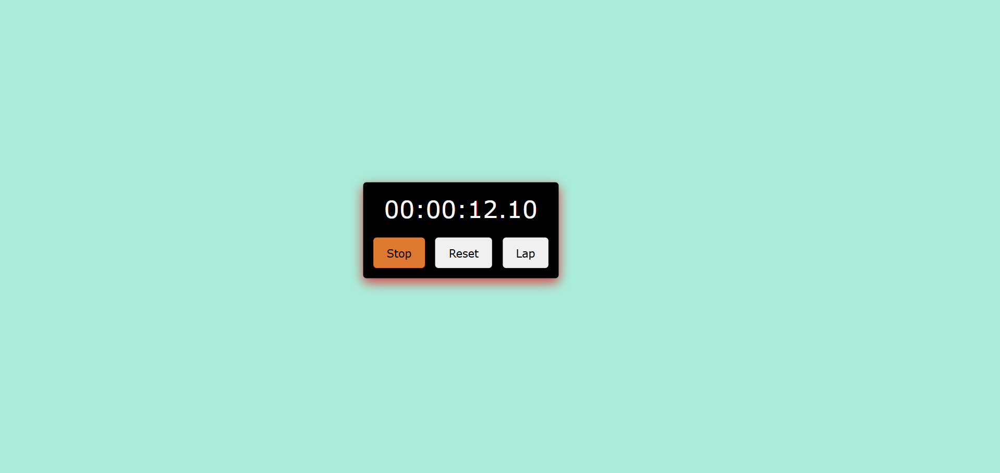
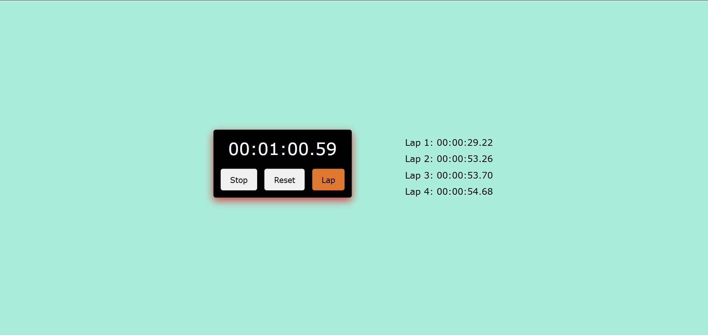

# PRODIGY_WD_02
🕒 Stopwatch Web App
This is a simple and interactive Stopwatch Web Application built using HTML, CSS, and JavaScript. It allows users to start, stop, reset, and record lap times with a clean and responsive UI.

🚀 Features
1. Start/Stop functionality
2. Reset timer
3. Record multiple lap times
4. Hover effect on stopwatch box
5. Responsive design

📸 Preview

🛠️ Technologies Used
1. HTML5
2. CSS3
3. JavaScript (ES6)
